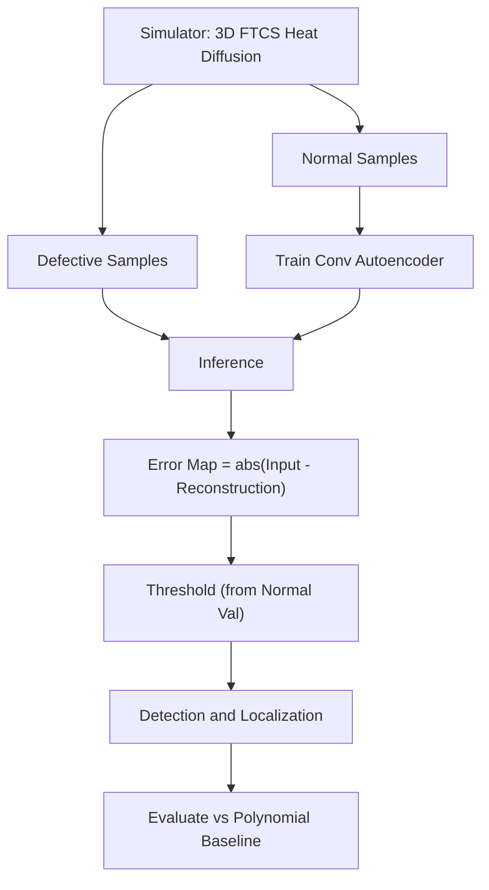
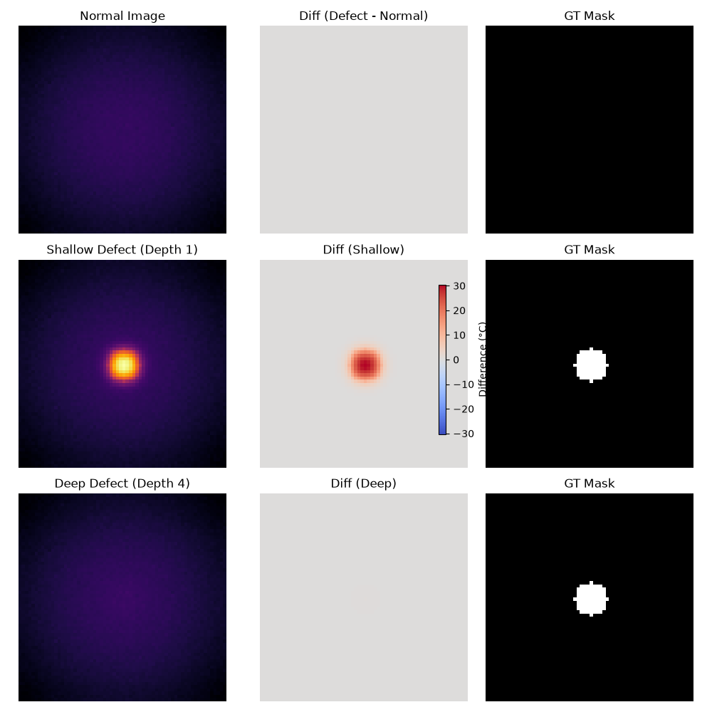
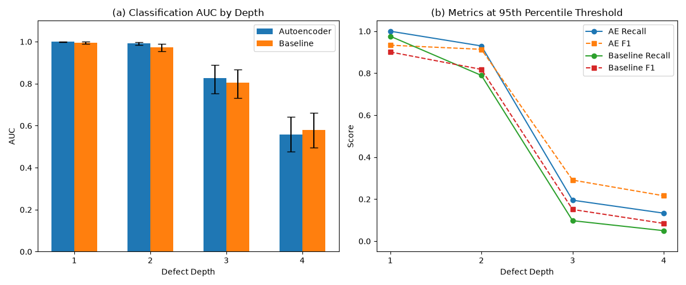
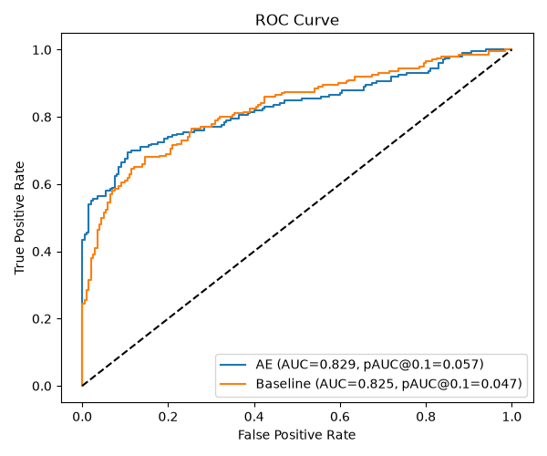
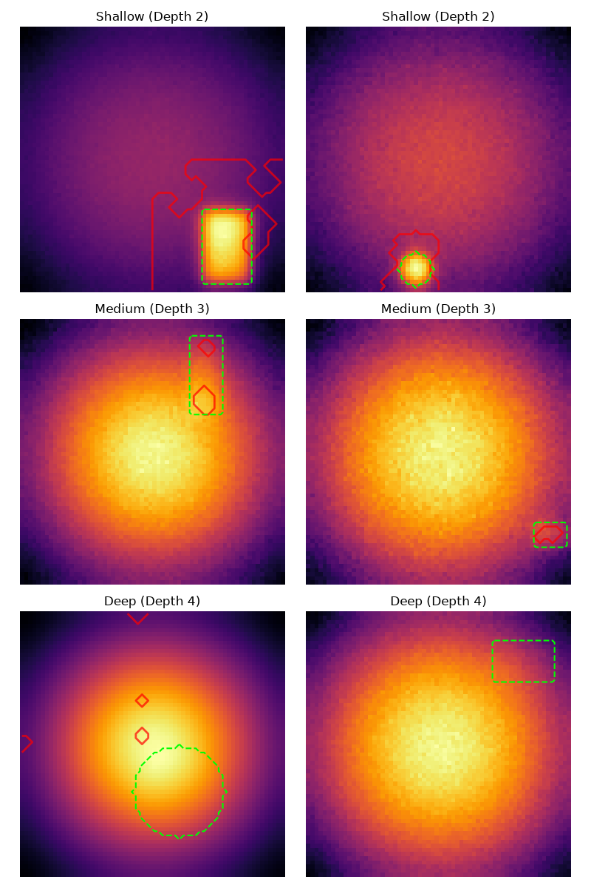
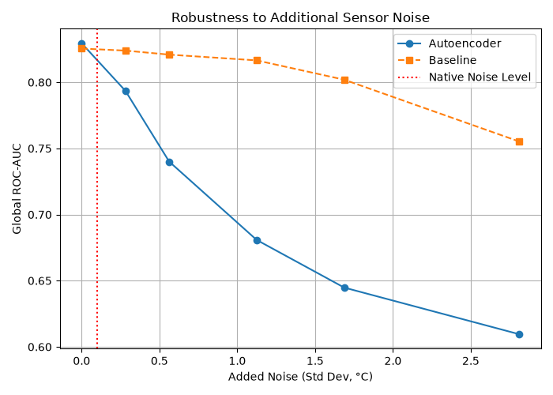
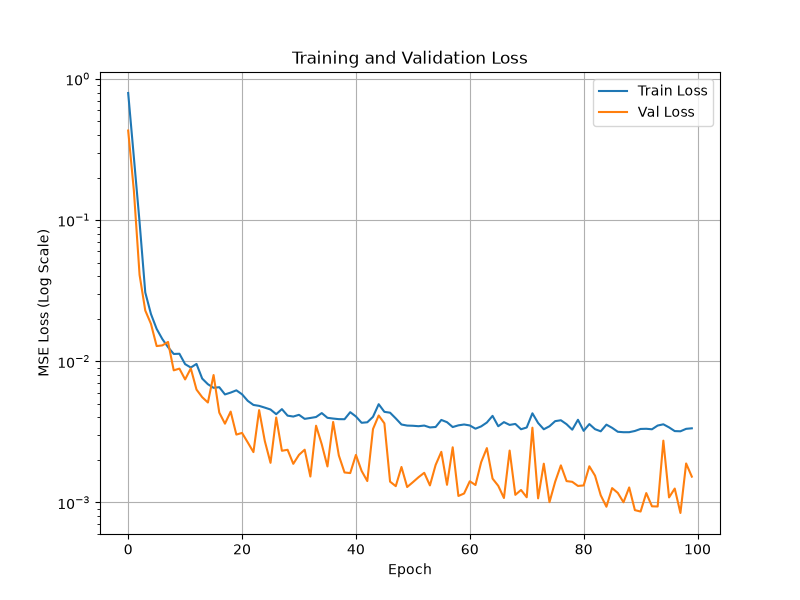

# ThermoRecon: Unsupervised Thermal Defect Detection Using Autoencoders

**Simulation-only proof of concept** for unsupervised anomaly detection of subsurface material defects using active thermography and convolutional autoencoders.

> [!WARNING]
> **Simulation-Only Proof of Concept**
> This repository relies entirely on synthetically generated thermal data. There is no real-world validation, and the simplified physical assumptions (e.g., perfect boundary conditions, no emissivity variations) mean performance on real IR camera data may differ significantly.

## Overview
Active thermography is a non-destructive testing technique where a material is heated and its surface temperature is monitored over time. Subsurface defects alter the heat diffusion, causing surface temperature anomalies. This project explores using a Convolutional Autoencoder (AE) trained *only on defect-free samples* to detect these anomalies based on reconstruction error, and compares it against a simple polynomial fitting baseline.

## Key Findings
- **Overall Performance Parity**: The Autoencoder performs approximately the same as the simple polynomial fitting baseline overall. The global AUC for the AE is 0.829 (95% CI: 0.787–0.869) and the baseline is 0.825 (95% CI: 0.779–0.864), with completely overlapping confidence intervals.
- **AE Advantages**: At the 99th-percentile threshold, the AE achieves higher recall on Depth 2 defects (0.754 vs 0.421) and produces no false alarms for shallow defects (Depths 1 & 2). The AE also has a slightly higher partial AUC at FPR < 0.1 (0.057 vs 0.047, no CI).
- **Baseline Advantages**: The baseline is more robust to added noise and performs better in the mid-FPR range of the ROC curve (see figure).
- **Noise Robustness**: When adding noise to both normal and defective test images, the AE's AUC falls from 0.83 at no added noise to 0.61 at 2.8 °C added noise, whereas the baseline falls from 0.83 to only 0.76. (Note: native dataset noise std is 0.1 °C. The AE was trained at a single noise level; whether noise augmentation would fix this brittleness is untested).
- **Localization (IoU)**: Both models exhibit low Intersection over Union (IoU) scores, even on true-positive detections. A working hypothesis is lateral heat spreading blurring the surface signature, but this is untested.

## Pipeline


## Synthetic Data
Data is generated using a 3D Forward Time Centered Space (FTCS) finite-difference solver for the conservative heat equation: `dT/dt = div(k * grad(T)) / (rho*c)`. Interfaces use the harmonic mean for thermal properties. 
- **Boundaries**: Gaussian heating is applied to the top surface (Z=0) with heat flux; all other boundaries are insulated.
- **Defects**: Simulated as regions with different thermal conductivity (`k`) and volumetric heat capacity (`rho*c`). Depths 5+ were excluded from evaluation as they fall below the noise floor. Depth effects arise naturally from the physics, not manual scaling.
- **Simulator Checks**: Stability is enforced via the FTCS stability condition (`alpha * dt / dx^2 <= 1/6`).

| Parameter | Value |
|-----------|-------|
| Grid Shape | 64x64 |
| Depth Layers | 10 |
| Train (Normal) | 1000 |
| Val (Normal) | 200 |
| Test (Normal) | 200 |
| Test (Defective) | 200 |
| Native Noise Std | 0.1 °C |
| Beam Sigma | 40.0 ± 10.0 |
| Base Temp | 20.0 ± 3.0 °C |

## Model and Method
- **Architecture**: Convolutional Autoencoder with a latent size of `64 x 4 x 4`.
- **Training**: Trained on normal images only, using MSE loss and Adam optimizer (lr=0.001) for 100 epochs (early stopping patience of 10 was configured but did not trigger). Images are normalized using stats derived strictly from the training set.
- **Anomaly Score**: Mean Squared Error (MSE) of the reconstruction.
- **Thresholds**: Derived from the normal validation set. Global metrics rely on the **99th-percentile** error of normal validation images.
- **Baseline**: Fits a 2D polynomial to the thermal image and thresholds the residual.

## Results
*Note: Global F1 scores rely on the 99th-percentile threshold. Because the overall AUCs are essentially equal, the observed F1 gap (0.592 AE vs 0.462 Baseline) is heavily dependent on the chosen threshold.*

**Global Results (99th-Percentile Threshold)**
- **AE**: AUC 0.829, F1 0.592
- **Baseline**: AUC 0.825, F1 0.462

**Classification by Depth (AE vs Baseline)**
*Normal validation error (denormalized): MAE 0.1262 °C, 99th-Percentile 0.4668 °C.*

| Depth | Threshold | AE Recall | Base Recall | AE AUC (95% CI) | Base AUC (95% CI) |
|-------|-----------|-----------|-------------|-----------------|-------------------|
| 1     | 99th      | 0.976     | 0.833       | 1.000 (0.998-1.000) | 0.996 (0.990-0.999) |
| 1     | 95th      | 1.000     | 0.976       | -               | -                 |
| 2     | 99th      | 0.754     | 0.421       | 0.993 (0.984-0.998) | 0.974 (0.955-0.989) |
| 2     | 95th      | 0.930     | 0.789       | -               | -                 |
| 3     | 99th      | 0.000     | 0.000       | 0.827 (0.753-0.888) | 0.805 (0.733-0.867) |
| 3     | 95th      | 0.195     | 0.098       | -               | -                 |
| 4     | 99th      | 0.000     | 0.033       | 0.557 (0.476-0.643) | 0.579 (0.494-0.660) |
| 4     | 95th      | 0.133     | 0.050       | -               | -                 |

*(Note: Depth 1 is an extremely easy task because the simulated contrast is ~18 °C, which is far larger than typical real-camera contrast. Depth 4 performance is at chance level, as CIs include 0.5.)*

### Visualizations
*(Note: The 6 localization overlay examples are the first two samples from each depth category in the test set; they were not hand-picked for best-case performance.)*


*Figure 1: Simulation output for normal, shallow, and deep defects, shown with a unified temperature difference scale.*


*Figure 2: AUC, Recall, and F1 broken down by defect depth.*


*Figure 3: Global ROC curve comparing the AE to the Baseline.*


*Figure 4: Ground truth vs Predicted masks for shallow, medium, and deep defects.*


*Figure 5: Performance degradation when synthetic noise is added to both normal and defective test images.*


*Figure 6: AE Training and Validation MSE Loss.*

## Installation and Usage
```bash
git clone https://github.com/manojperi26/thermal-defect-detection
cd thermal-defect-detection
python -m venv venv
# Windows:
.\venv\Scripts\activate
# Linux/Mac:
source venv/bin/activate
pip install -r requirements.txt
```
*(Note: `data/` is intentionally gitignored. The dataset must be generated locally before training.)*

## Reproducing the Results
Execute the scripts in the following order:

1. **Simulator Validation (Optional):**
   ```bash
   python scripts/physics_checks.py
   ```
2. **Generate Dataset:**
   ```bash
   python src/data_generator.py
   ```
3. **Train Autoencoder:**
   ```bash
   python src/train.py
   ```
   *(Models are saved to `models/` and loss history to `results/metrics/`)*
4. **Evaluate Metrics:**
   ```bash
   python src/evaluate.py
   ```
   *(Evaluation outputs are saved to `results/metrics/evaluation_fixed.json`)*
5. **Generate Plots:**
   ```bash
   python src/visualize.py
   ```
   *(Plots are saved to `results/figures/`)*
6. **Print Console Summary:**
   ```bash
   python scripts/print_summary.py
   ```

## Configuration
All primary hyper-parameters are in `config/config.yaml`:
- `data.physics.*`: Controls heat intensity, beam standard deviation, base temperature, and material properties.
- `data.depth_layers`: Determines how deep the simulation grid extends.
- `training.*`: Epochs, patience, learning rate, and batch size.

## Repository Structure
```text
D:\ThermoRecon Unsupervised Thermal Defect Detection Using Autoencoders\
├── .gitignore
├── README.md
├── requirements.txt
├── config/
│   └── config.yaml
├── models/
│   └── best_autoencoder.pth
├── results/
│   ├── figures/
│   └── metrics/
├── scripts/
│   ├── physics_checks.py
│   └── print_summary.py
└── src/
    ├── baseline.py
    ├── data_generator.py
    ├── dataset.py
    ├── evaluate.py
    ├── model.py
    ├── preprocessing.py
    ├── train.py
    └── visualize.py
```

## Limitations
1. **Simulation Only:** Simplified physics model with no real-world gap handling (emissivity, environment, camera noise, real materials).
2. **Single Frame:** The current model evaluates isolated frames; it ignores the critical time dimension (thermal sequences) used in modern thermography.
3. **Depth Limitations:** Deep defects (Depth 4) are undetectable (chance-level performance), and Depth 1 is unrealistically easy.
4. **Noise Intolerance:** The AE is substantially less noise-tolerant than the simple polynomial baseline.
5. **Score Dilution:** Mean-MSE anomaly scoring may dilute small defect signals (untested alternative: max or top-k MSE).
6. **Variability:** Evaluated on a single simulator configuration and a single random seed.

## Future Work
- **Temporal Modeling:** Extend to thermal sequences using ConvLSTM or 3D CNNs to leverage time-domain heat dissipation.
- **Advanced Excitation:** Implement chirp or Barker coded thermal excitation paired with matched filtering.
- **Model Improvements:** Train a Denoising AE with extensive noise augmentation to address the observed noise brittleness, and explore max/top-k anomaly scoring.
- **Real-World Data:** Validate against real IR camera data from physical material samples.

## References
Libraries used in this project:
- PyTorch
- NumPy
- SciPy
- scikit-learn
- scikit-image
- Matplotlib
- PyYAML

## Author
**Peri Manoj**
- GitHub: [manojperi26](https://github.com/manojperi26)
- LinkedIn: [manojperi26](https://linkedin.com/in/manojperi26)

## License
TODO (I will decide)
